# 🦠 基于 Apache Spark 的美国新冠疫情多维数据挖掘与可视化推演
> **大数据处理与分析课程设计项目**

 


本项目基于纽约时报开源的美国 COVID-19 历史追踪数据集，构建了以 **Hadoop HDFS** 为底层存储、**Apache Spark** 为核心内存计算引擎、**PyEcharts** 为前端渲染的大数据分析流水线。项目自底向上执行了数据清洗、特征衍生、时序平滑、传播动力学建模以及 K-Means 机器智能聚类，共计实现了 20 项高阶数据科学分析需求。

## 📑 核心特性与架构

系统采用高内聚、低耦合的三层批处理架构：

1. **分布式存储与调度 (HDFS / YARN)：** 应对百万级时空异构数据，解决单机 I/O 瓶颈。
2. **Spark 多维计算层 (Core / SQL / MLlib)：**
   - 摒弃昂贵的全局自连接 (Self-Join)，大量采用 Spark `Window` 开窗函数与 `lag` 算子实现时序指标的滑动计算与降噪。
   - 引入 K-Means 算法在双对数坐标系下进行多维特征的无监督风险定级。
3. **动态可视化呈现 (PyEcharts)：** 数据结果轻量化 JSON 落盘，驱动前端动态时间轴、南丁格尔玫瑰图、地理映射飞线图等交互式渲染。

## 🛠️ 环境依赖

- 操作系统：Ubuntu 16.04
- 核心组件：Hadoop 3.1.3, Spark 3.3.2 
- 语言环境：Python 3.8+ 
- 核心依赖库：`pyspark`, `pyecharts`

## 🚀 快速启动

**1. 准备数据**
将原始数据集 `us-counties.txt` 上传至 HDFS 指定目录：
```bash
hdfs dfs -mkdir -p /user/hadoop-wei/
hdfs dfs -put data/us-counties.txt /user/hadoop-wei/
```

## 2. 一键执行 Spark 计算流水线

进入脚本目录，赋予执行权限并运行批处理调度脚本。该脚本会自动按业务依赖顺序，向 Spark 集群提交所有的 `.py` 计算任务：

```bash
chmod +x scripts/run_all_tasks.sh
./scripts/run_all_tasks.sh
```

## 📊 20 大核心业务需求全景展示与深度推演

本项目自底向上共实现了 20 项高阶数据分析需求，打通了从基础态势感知到机器学习预测的完整闭环。以下为全部核心结果与洞察：

### 一、 总体态势感知模块
宏观刻画疫情的绝对规模与增量波动，提取早期爆发特征。

* **需求 1：全美每日疫情累计确诊与死亡综合走势**
    * 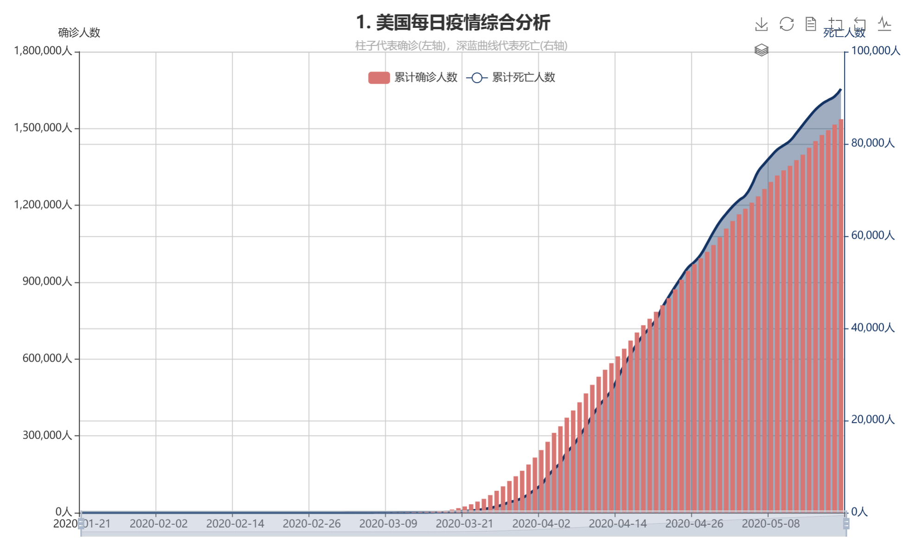
    * **分析：** 双轴图清晰揭示了疫情的指数级增长阶段，确诊曲线斜率自 3 月中旬急剧变大，标志着病毒进入社区大规模传播爆发期。
* **需求 2：全美每日新增确诊与死亡波动及均值基线**
    * 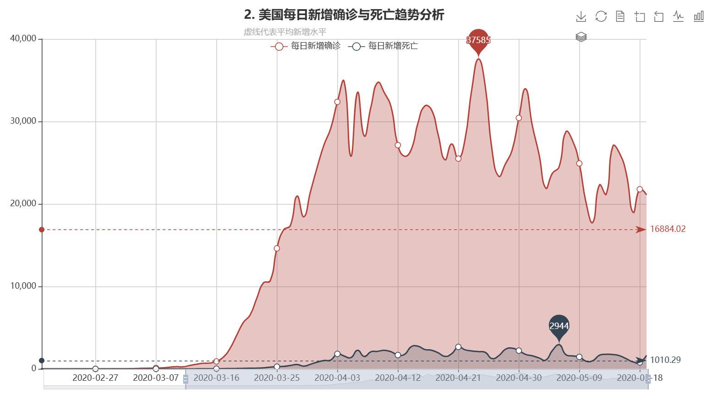
    * **分析：** 全美单日新增波动极其剧烈且死亡趋势存在明显滞后，这从侧面验证了利用滑动窗口进行降噪预处理的必要性。

### 二、 空间分布与地理演变模块
结合地理信息数据，探讨疫情在物理空间层面的极度不均与动态漂移。

* **需求 3：各州疫情死亡率空间热力分布**
    * 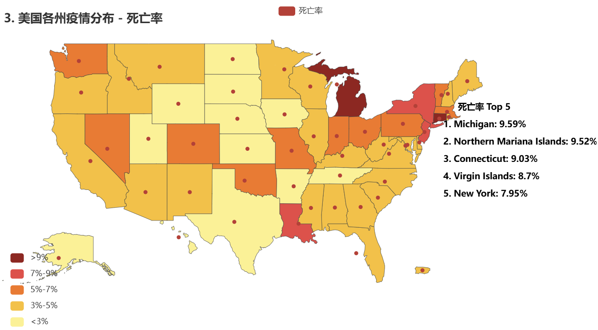
    * **分析：** 深红色高危区域显著集中在五大湖区与东北部沿海（如密歇根州），直观暴露了早期重灾区医疗系统的极端过载压力。
* **需求 4：全美疫情加权重心地理漂移轨迹**
    * 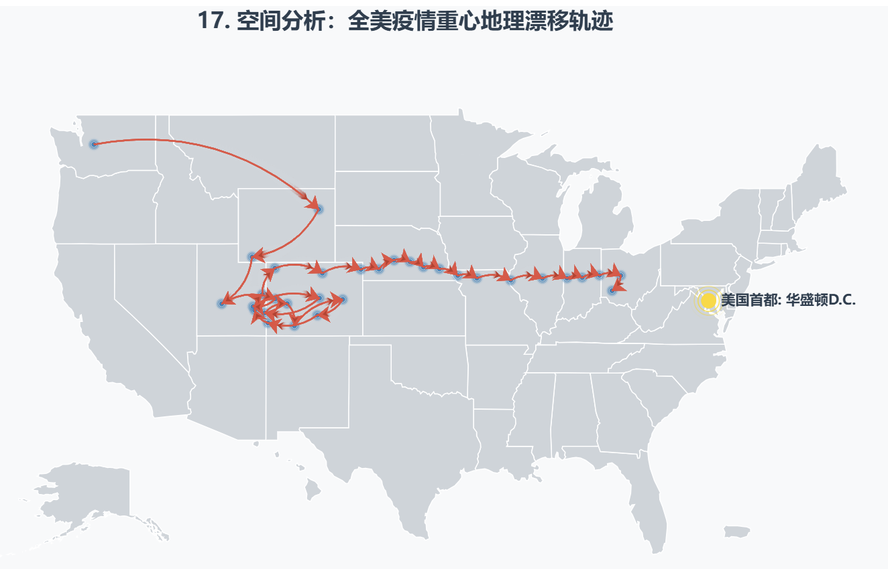
    * **分析：** 飞线图完美复盘了疫情物理重心从西海岸向东海岸极速漂移的轨迹，精准印证了纽约周边迅速沦为绝对“风暴眼”的客观事实。

### 三、 排名、占比与长尾效应模块
剖析资源承压分布，验证重灾区的宏观代价。

* **需求 5：美国各州累计确诊 Top 10 榜单**
    * 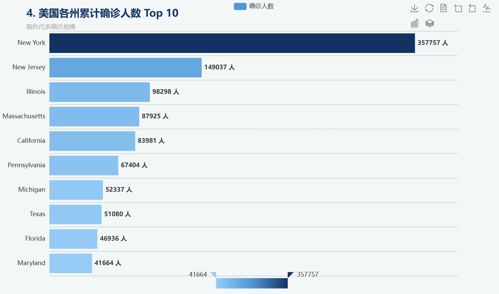
    * **分析：** 纽约州以超 35 万例的绝对规模高居榜首，对全美其他州形成断层式碾压。
* **需求 6：美国各州累计死亡人数 Top 10 榜单**
    * 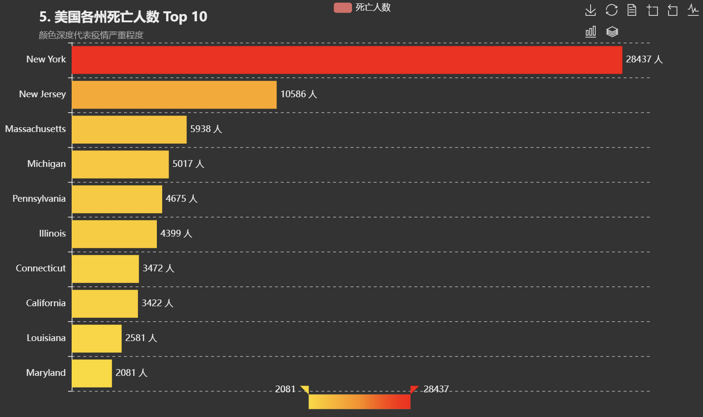
    * **分析：** 纽约州与新泽西州包揽前两名，直观展现了东海岸重灾区在早期面临的残酷伤亡代价。
* **需求 7：全美总体病死率占比分析**
    * 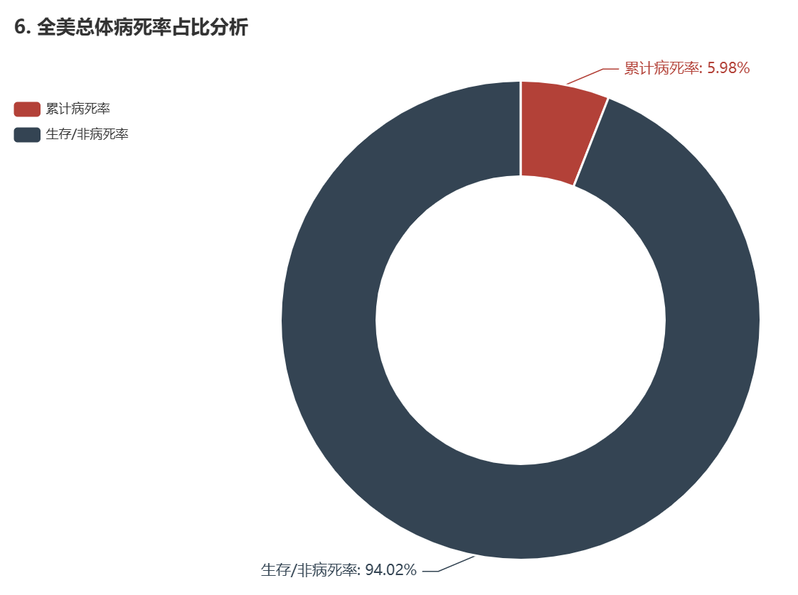
    * **分析：** 全美平均病死率高达 5.98%，在百万级感染基数下，确立了本次公共卫生危机极高危险性的基调。
* **需求 8：死亡病例的帕累托 (80/20) 分析**
    * 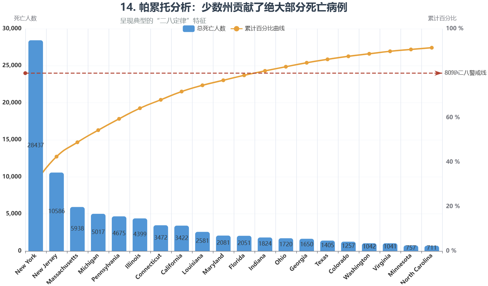
    * **分析：** 累计百分比曲线完美印证了“二八定律”，前十重点州累计死亡人数迅速击穿 80% 警戒线，为稀缺医疗资源向“风暴眼”靶向倾斜提供了实证支撑。

### 四、 传播动力学建模模块
剥离噪音，量化各州的真实恶化动能与扩张加速度。

* **需求 9：全美各州 7 天滚动平均新增 Top 20 榜单**
    * 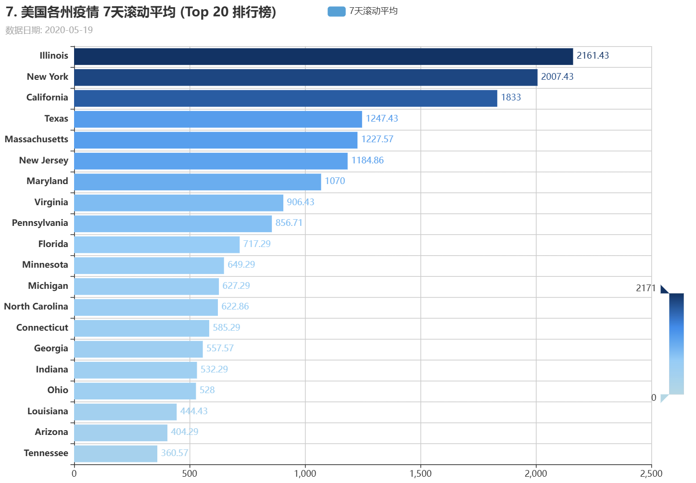
    * **分析：** 消除周末噪音后，伊利诺伊州的真实日均新增反超了处于管控回落期的纽约州，精准预警了接力向中西部蔓延的严峻趋势。
* **需求 10：各州疫情环比增速“红黑榜”对比**
    * 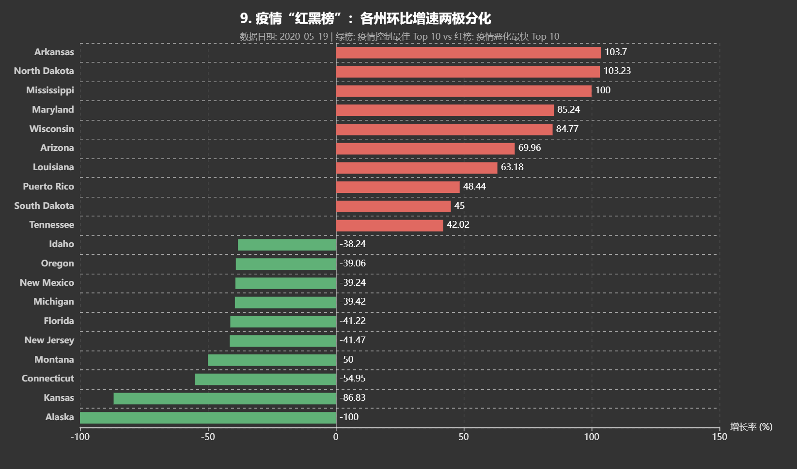
    * **分析：** 发散型条形图精准锁定了各州恶化动能，阿肯色州与北达科他州以超过 103% 的极高增速领跑“红榜”。
* **需求 11：全美各州确诊翻倍时间 (Td) 测算**
    * 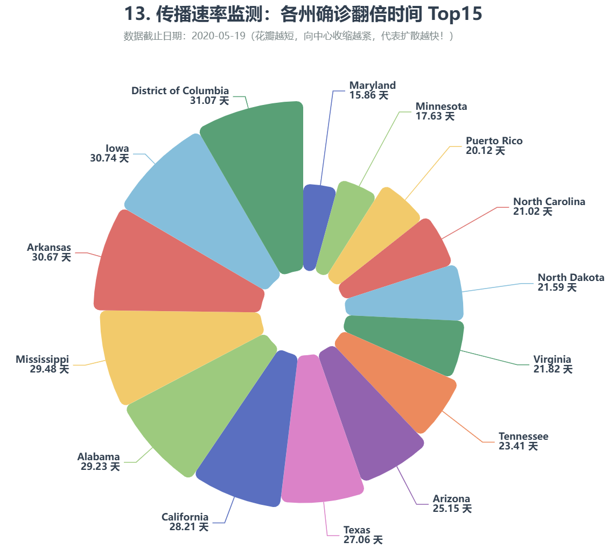
    * **分析：** 南丁格尔玫瑰图量化了隐性爆发期的指数级扩张能力，马里兰州以仅 15.86 天的极短时间处于高危最内圈。
* **需求 12：纽约州有效传染数 (Rt) 时序演变追踪**
    * 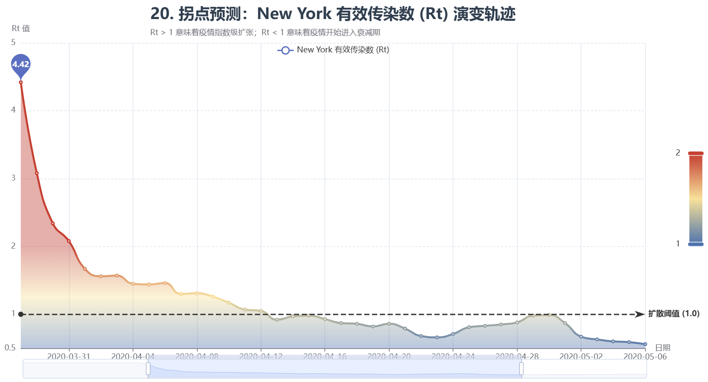
    * **分析：** Rt 值随管控政策收紧从失控高位断崖式下跌，并长期稳定在 1.0 阈值之下，从动力学数学定义上标定了疫情的实质衰减拐点。

### 五、 异常检测与统计学监测模块
在极限施压测试中，精准定位资源挤兑极值与历史突发节点。

* **需求 13：各州单日最高新增极值气泡图**
    * 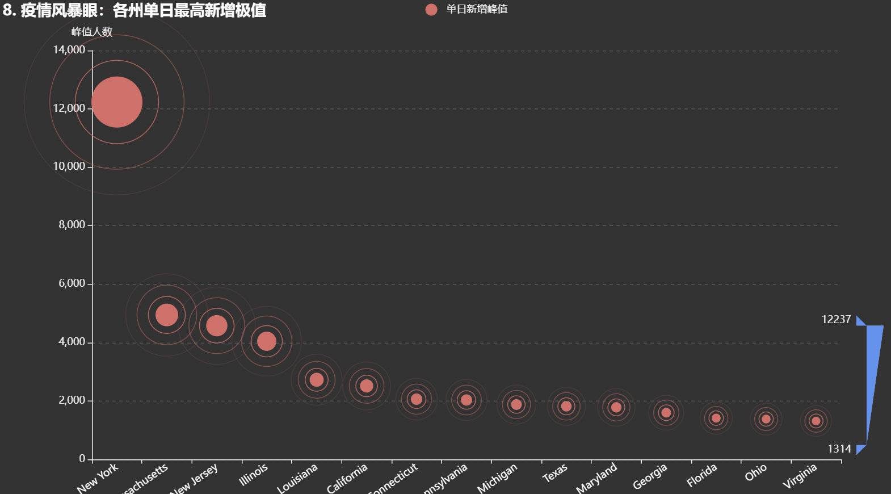
    * **分析：** 纽约州曾遭遇高达 12,237 例的单日峰值气泡，榜首尾接近十倍的落差直观反映了资源挤兑的残酷性。
* **需求 14：异常爆发点 Z-Score 统计学监测**
    * 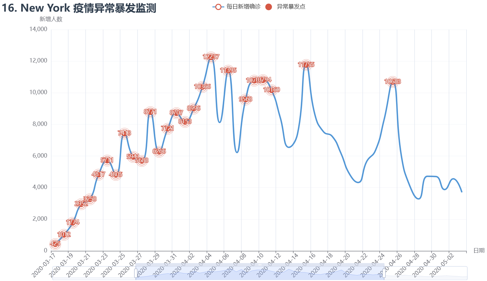
    * **分析：** 引入异常检测算法，将红圈高亮节点精准判定为非正常统计学异常点，为溯源早期聚集性感染事件提供数据靶标。
* **需求 15：基于 Day-0 对齐的半对数爆发轨迹对比**
    * 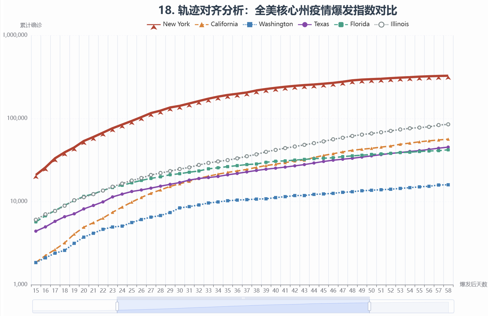
    * **分析：** 打破物理时间轴后，揭示了强烈的“路径依赖”规律：爆发初期的蔓延斜率几乎提前锁死了该地区最终的疫情规模天花板。

### 六、 深度规律挖掘与 AI 智能赋能模块
突破描述性统计，引入相关性检验与无监督机器学习聚类。

* **需求 16：疫情风暴眼转移轨迹动态时空切片**
    * 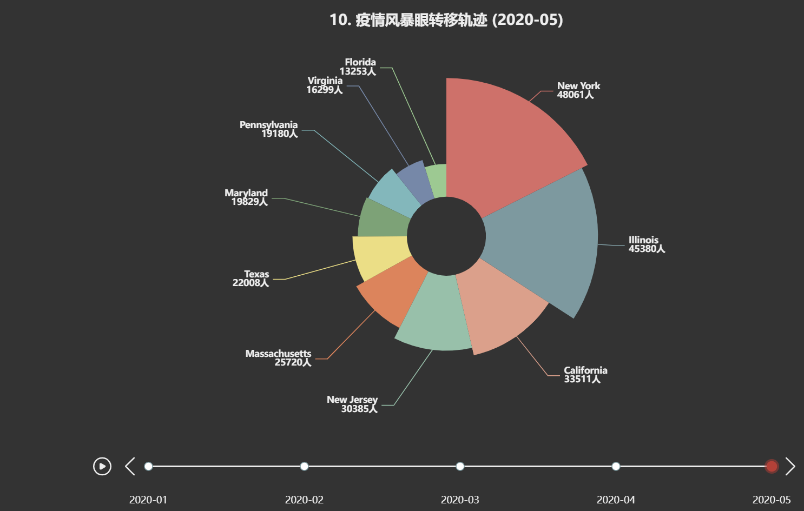
    * **分析：** 极轴图动态复原了时空分布格局，纽约与伊利诺伊州占据绝对主导扇形面积。
* **需求 17：全美按星期平均新增分布雷达图**
    * 
    * **分析：** 呈现极其明显的“周末内凹、工作日外凸”特征，确凿证实了基层医疗机构“周末漏报”的系统性偏差，这也是后台引入开窗函数降噪的根本底层逻辑。
* **需求 18：全美重点州致死率 (CFR) 时序演变**
    * 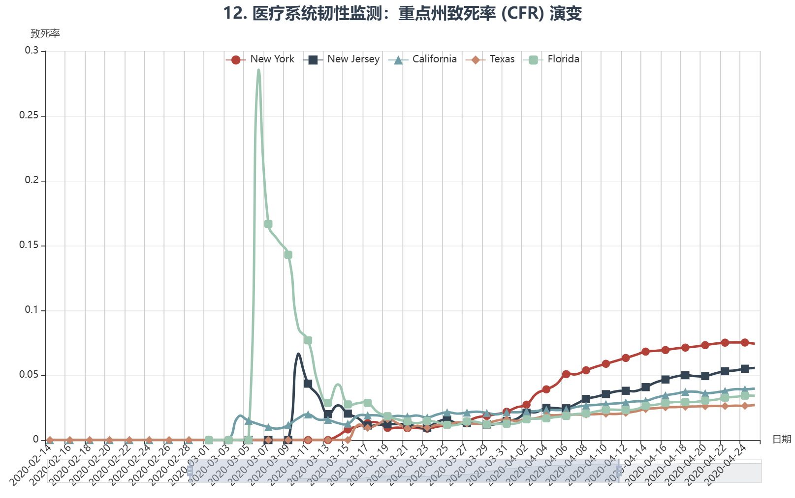
    * **分析：** 完整记录了医疗系统的承压周期，部分州早期 CFR 出现接近 28% 的极端异动，反映了核酸检测能力不足下的体系崩溃状态。
* **需求 19：确诊与死亡时滞相关性 Pearson 检验**
    * 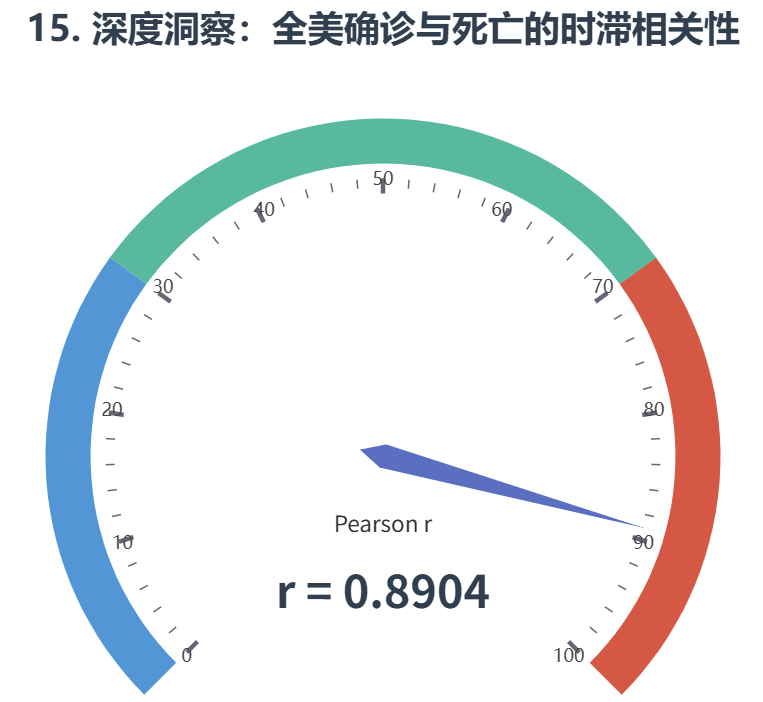
    * **分析：** 输出了逼近 0.9 的强正相关系数 (r=0.8904)，以数学方式无可辩驳地确立了“确诊激增”对后续“死亡高峰”的绝对前置预警地位。
* **需求 20：基于 K-Means 算法的全美各州疫情风险智能聚类**
    * 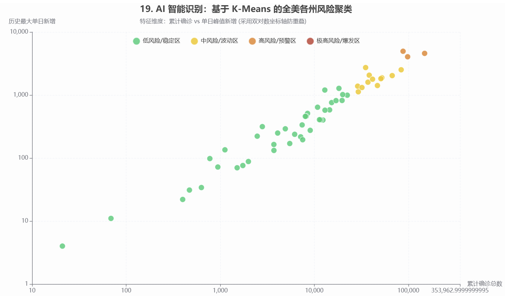
    * **分析：** 摒弃人为划分阈值的主观干预，依托 Spark MLlib 基于多维特征相似度自动将全美划分为四大阵营，实现了真正的 AI 纯数据驱动风险定级。
